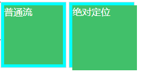

# 3. 流、元素与基本尺寸

## 3.1 块级元素

块级元素具有换行特性，因此理论上都可以配合 clear 属性来清除浮动带来的影响。

list-item 元素出现项目符合的原因：list-item 有一个附加盒子（标记盒子）

每个元素都有两个盒子——内在盒子和外在盒子

inline-block 外在的内联盒子和内在的块级容器

**width/height 作用在内在盒子上**

## 3.2 width/height 作用的具体细节

### 3.2.1 `width:auto`

1. 充分利用可用的空间。 `<div>`、`<p>`这些元素宽度默认是100%于父级容器。
2. 收缩和包裹。典型代表就是浮动、绝对定位、inline-block元素或table元素, shrink-to-fit，收缩到合适。
3. 收缩到最小。
4. 超出容器限制。内容为很长的英文和数字，或者内联元素被设置了 `white-space: nowrap`.

<div>默认宽度100%显示，是“外部尺寸”，其余全部“内部尺寸”。而这唯一的“外部尺寸”，是“流”的精髓所在。

#### 外部尺寸与流体尺寸

1) 正常流宽度

流动性是一种margin/border/padding和content内容区域自动分配水平空间的机制。

2) 格式化宽度

格式化宽度仅出现在“绝对定位模型”中。在默认情况下，绝对定位元素的宽度表现为“包裹性”，宽度由内部尺寸决定，但是，对于非替换元素，当left/right或top/bottom对立方位的属性值同时存在的时候，宽度由外部尺寸决定。元素的宽度表现为“格式化宽度”，其宽度大小相对于最近的具有定位特性（position不是static）的祖先元素计算。

```css
div{
  position: absolute;
  let: 20px;
  right:20px;
}
```
假设该div元素最近的具有定位特性的祖先元素的宽度是1000px，则这个<div> 元素的宽度是960px (1000-20-20)px。

和普通流一样，“格式化宽度”具有完全的流体性，即 margin、border、padding、content区域同样会自动分配水平（垂直）空间。

#### 内部尺寸与流体特性

1) 包裹性
2) 首选最小宽度 —— 元素最适合的最小宽度。
东亚文字（如中文）最小宽度为每个汉字的宽度。西方文字的最小宽度由特定的连续的英文字符单元决定。`word-break:break-all`可使英文字符与中文一样。

首选最小宽度可以实现“凹凸”效果。
```css
.ao{
  display:inline-block;
  width:0;
}
.ao:before{
  content:'love你love';
  color:#fff;
  outline: 1px solid;
}
```
3) 最大宽度

### 3.2.2 width值作用的细节

content box 环绕着width和height给定的矩形，即width默认是作用在content-box上的。
因为css2.1是面向内容（图文信息）设计的，所以，width设计成了直接作用在content-box上。

### 3.2.3 box-sizing——改变width/height作用细节

替换元素的特性之一就是尺寸由内部元素决定,不受display属性的影响。（不管其display属性值是inline还是block)
正是因为如此，display设置为block也不能自适应容器大小，只能通过width:100%;但是input等替换元素是有border的，且需要一定的padding大小，于是width/border与padding注定要共存。

box-sizing 被发明的最大的初衷应该是解决替换元素宽度自适应问题

`width:100%` 和 `height: 100%` 的区别：对于width属性，即使父元素width为auto，还是支持百分比，但是，对于height属性，如果父元素height为auto，只要子元素在文档流中，其百分比值完全就被忽略了。

如果包含块的高度没有显示指定（即高度由内容决定），且该元素不是绝对定位，则计算值为auto，高度百分比计算自然无果。而宽度的解释是：如果包含块的宽度取决于该元素的宽度，那么产生的布局在css2.1中是未定义的，由浏览器自由发挥，就按照包含块真实的计算值作为百分比计算的基数。

如何让元素支持 height；100% 效果
1. 设定显示的高度值
2. 使用绝对定位
```css
div{
  height:100%;
  position: absolute;
}
```
绝对定位元素的宽高百分比是相对于padding box 的，而非绝对定位元素的宽高百分比是相对于content box计算。
```html
<style>
  .abso {
    width: 100px;
    height: 100px;
    border: 1px solid #ddd;
    padding: 5px;
    background-color: aqua;
    color: #fff;
    display:inline-block;
  }
  .content .child {
      height: 100%;
      background-color: #41c06a;
  }

  .abso {
      position: relative;
  }

  .abso .child {
      height: 100%;
      position: absolute;
      background-color: #41c06a;
      /* 注意绝对定位模型的尺寸是格式化宽度，宽度由内部尺寸决定 */
      width: 100%;
  }
</style>
<body>
  <div class="content">
        <div class="child">
            <span>普通流</span>
        </div>
    </div>
    <div class="abso">
        <div class="child">
            绝对定位
        </div>
    </div>
</body>
```


利用这一特性可以达到一些特殊效果（比如“图片左右半区点击分别显示上一张图和下一张图的效果）。只要在图片上覆盖两个绝对定位，同时设`height:100%`。

## 3.3 css min-width/max-width 和 min-height/max-height

### 3.3.1 为流体而生的 min-width/max-width

width和height的初始值都是auto，但是max-width和max-width的初始值是none，min-width/min-height的初始值为auto。

### 3.3.3 超越!important,超越最大

超越!important 指的是max-width会覆盖width
```html

<style>
img{max-width: 245px;}
</style>
```
最终的宽度是245px.

超越最大指的是min-width会覆盖max-width
```css
  div{
    min-width:1300px;
    max-width:1000px;
  }
```
最终div的宽度为至少为1300px。

## 3.4 内联元素

### 3.4.1 内联盒模型

1. 内容区域（content area）

可以理解为文字的选中背景

2. 内联盒子（inline box）——使元素排成一行，指元素的外在盒子

可以分为“内联盒子”和“匿名内联盒子”，如果外部由内联标签则称为“内联盒子”，如果只是光秃秃的文字则为“匿名内联盒子”。

**注意**：并不是所有的光秃秃的文字都是“匿名内联盒子”，还可能是“匿名块级盒子”，关键看前后的标签是内联还是块级。

3. 行框盒子（line box）

每一行都是一个行框盒子，由一个个内联盒子组成。

4. 包含盒子（containing box）/包含块

<p>标签就是一个包含盒子，由一个个行框盒子组成。

### 3.4.2 <strong style="color:red;">幽灵空白节点</strong>

> 在HTML5文档声明中，内联元素的所有的解析和渲染表现就如同每个行框盒子的前面有一个“空白节点”一样。这个“空白节点”永远透明，不占据任何宽度，看不见也无法通过脚本获取，就好像幽灵一样，但又确确实实存在，表现如同文本节点一样。

**注意** 必须是hmtl5声明，如果还是以前的老声明，则不存在“幽灵空白节点”

“幽灵空白节点”也是一个盒子，不过是个假想盒，叫“strut”（支柱），是一个存在于每个**行框盒子**前面，同时具有该元素的**字体**和**行高**属性的0宽度的内联盒。

> Each line box starts width a zero-width inline box with the element's font and lint height properties. We call that imaginary box a "strut".