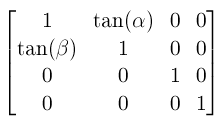
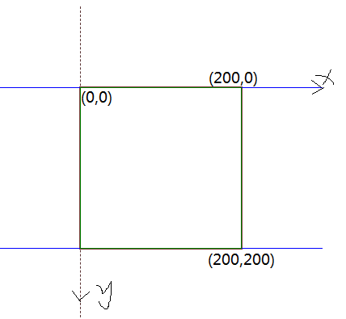
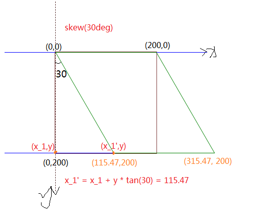

# transform

css 的 transform 变换时有正负 2 个方向，在 CSS 中正表示顺时针，负表示逆时针

## 1. skew 倾斜

[CSS3-skew 定义](https://www.w3.org/TR/css-transforms-1/#SkewXDefined)

skew 变换后的坐标计算公式如下：

`X' = X + tan( \alpha ) * Y`

`Y' = tan(\beta) * X + Y`

例子 1、做 skew(30deg),此时 \alpha = 30, \beta = 0;

设置 `transform-origin:0,0;`即元素的左上角为变换中心

图 1.原图

`skew(30deg)/skewX(30deg)` 表示 X 轴逆时针倾斜 30deg，看到到效果就是元素的高度保存不变，其左上和右下角会被“拉扯”。如图 2 所示

图 2.skew(30deg) 变换后

## rotate 旋转变换

旋转方向可以相邻轴线的方向判断，与轴线方向相同。

- 即 rotateX 的正方向与 Z 轴的正方向一致（垂直屏幕向里）
- rotateY 的正方向与 X 轴的正方向一致（水平向右）
- rotateZ 的正方向与 Y 轴的正方向一致（垂直向下）
