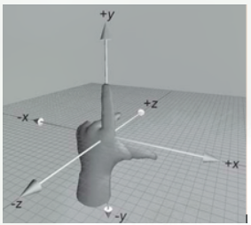
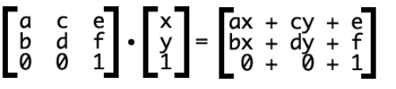

# transform

css 的 transform 变换时有正负 2 个方向，在 CSS 中正表示顺时针，负表示逆时针

## 1. skew 倾斜

[CSS3-skew 定义](https://www.w3.org/TR/css-transforms-1/#SkewXDefined)


skew 变换后的坐标计算公式如下：

`X' = X + tan( \alpha ) * Y`

`Y' = tan(\beta) * X + Y`

例子 1、做 skew(30deg),此时 \alpha = 30, \beta = 0;

设置 `transform-origin:0,0;`即元素的左上角为变换中心


图 1.原图

`skew(30deg)/skewX(30deg)` 表示 X 轴逆时针倾斜 30deg，看到到效果就是元素的高度保存不变，其左上和右下角会被“拉扯”。如图 2 所示


图 2.skew(30deg) 变换后

## rotate 旋转变换

<span style="color:red;font-weight:bold">\*注意：css3 中坐标轴是相对于物体，当元素旋转的时候，坐标轴页跟着旋转。</span>

### 左手坐标系

伸出左手，让拇指和食指成“L”形，大拇指向右，食指向上，中指指向前方。这样我们就建立了一个左手坐标系，拇指、食指和中指分别代表 X、Y、Z 轴的正方向。如下图



### CSS 中的 3D 坐标系

CSS3 中的 3D 坐标系与上述的 3D 坐标系是有一定区别的，相当于其绕着 X 轴旋转了 180 度，如下图


rotate(30deg) 即为 rotateZ(30deg)

[二维变换矩阵](!https://www.zhangxinxu.com/wordpress/2012/06/css3-transform-matrix-%E7%9F%A9%E9%98%B5/)



假设角度为 `θ`
martix 的参数如下

`matrix(cosθ,sinθ,-sinθ,cosθ,0,0)`

```math
x' = x*cosθ-y*sinθ+0 = x*cosθ-y*sinθ
y' = x*sinθ+y*cosθ+0 = x*sinθ+y*cosθ
```
