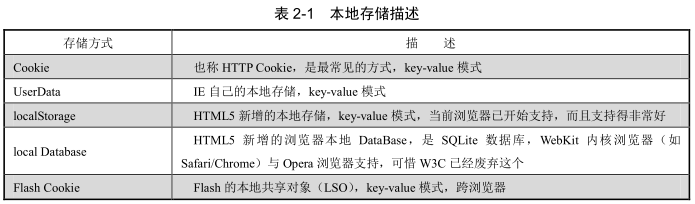

# cookie、session 与 localStorage

## cookie 与 session

> 同域内浏览器中发出的任何一个请求都会带上 Cookie，无论请求什么资源，请求时，Cookie 出现在请求头的 Cookie 字段中。服务端响应头的Set-Cookie 字段可以添加、修改和删除 Cookie，大多数情况下，客户端通过 JavaScript 也可以添加、修改和删除 Cookie。

### 本地cookie与内存cookie

它与过期时间（Cookie 的 expires 字段）紧密相关。如果没设置过期时间，就是内存 Cookie，这样的 Cookie 会随着浏览器的关闭而从内存中消失；如果设置了过期时间是未来的某个时间点，那么这样的 Cookie 就会以文本形式保存在操作系统本地，待过期时间到了才会消失。

### 本地存储的方式：

1. cookie

  大多数浏览器限制**每个域能有 50 个 Cookie**。不同的浏览器能存储的 Cookies 是有差异的，其**最大值约为 4KB**.

  删除 Cookie 时，仅需设置过期值为过去的时间即可。Cookie 无法跨浏览器存在。
2. userData

  用户数据的**每个域最大为 64KB**。这种存储方式只有 IE 浏览器自己支持
3. sessionStorage

  如果仅存储在内存中，则是sessionStorage。它们的语法都一样，仅仅是一个存储在本地文件系统中，另一个存储在内存中（随着浏览器的关闭而消失）。

  localStorage 无法跨浏览器存在。

  除了 Opera 浏览器采用 BASE64 加密外（BASE64 也是可以轻松解密的），其他浏览器均采用明文存储数据。

  另一方面，在数据存储的时效性上，只要用户不主动删除，localStorage 存储的数据将会永久存在。
4. Flash Cookie

  Flash 是跨浏览器的通用解决方案，Flash Cookie 的默认存储数据大小是 100KB。