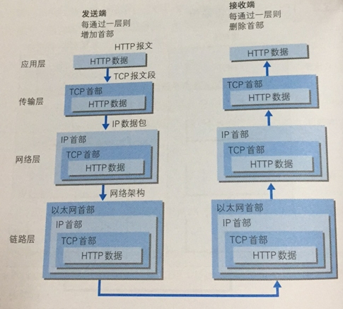
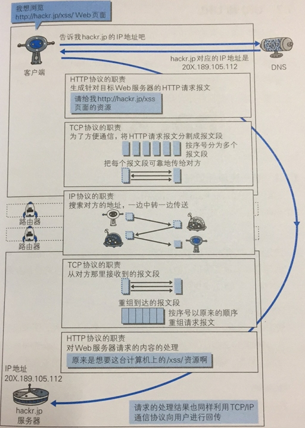

# HTTP 协议通信过程

## TCP/IP通信过程

TCP/IP 协议族分为四层

1. 应用层 -HTTP、DNS HTTP报文
2. 传输层 - TCP TCP报文段
3. 网络层 - IP IP数据包
4. 数据链路层

如下图：

## HTTP协议通信过程

1. 客户端访问 url 为 `http://xxx.com/xss/` 的地址，通过 DNS 服务查询对应的IP地址，得到 `202.198.1.22` 。

2. HTTP 协议：生成针对目标web 服务器的 HTTP 请求报文 “请给我 `http://xxx.com/xss/` 页面的资源”。

3. TCP 协议：为了方便通信，将HTTP请求报文分割成报文段，把每个报文段可靠地传给对方。

4. IP 协议：搜素对方的地址，一遍中转一遍传送。（路由器）

5. TCP 协议：从对方那里收到报文段，按序号以原来的顺序重组请求报文。

6. http 协议：对web服务器请求的内容的处理

7. 请求的处理结果也同样利用TCP/IP 通信协议进行回传。

如下图所示：

HTTP 是无状态协议，为了实现保持状态的功能，引入了cookie技术