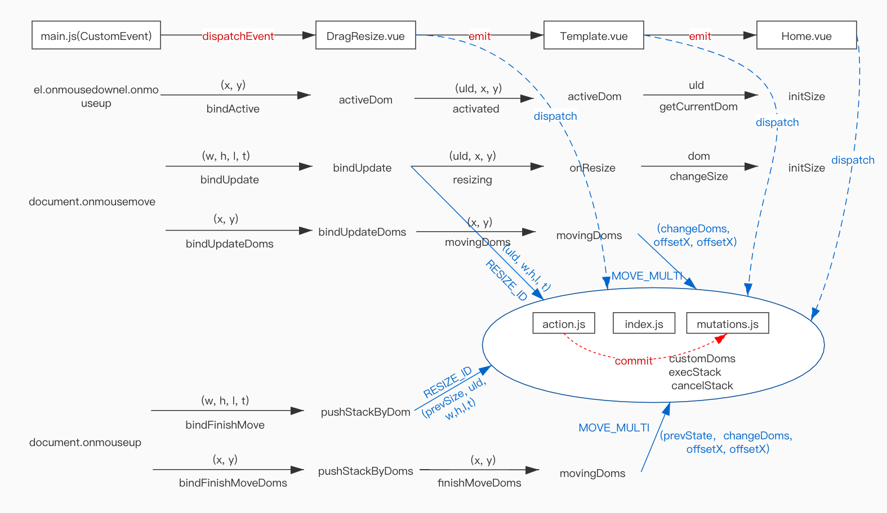

## vue 使用自定义指令实现拖拽

需求背景，工作中需要实现一个自定义打印模板的需求，能够实现**单个及多个**dom元素的同时拖拽，也能通过外部的input元素修改dom元素的样式。在npm和GitHub上找了各种已有的vue组件，不够灵活，效果都不是自己想要的

1. [vue自定义指令](https://cn.vuejs.org/v2/guide/custom-directive.html)
```js
Vue.directive('dragx', (el, binding, vnode) => {
  //  默认参数
  let defaultOpts = {
    dragContainerId: '', //
    dragBarClass: '', // 类选择器
    canDrag: true,
    canResize: true,
    zoomsize: 1, // 模版的缩放比例
    multiSelect: false
  }
  let isMove = false
  let isResize = false
  let constraintDom
  let constraintRect
  let constraintRectHeight
  let constraintRectWidth
  binding.value = binding.value || {}
  let cfg = Object.assign({}, defaultOpts, binding.value)
  if (cfg.dragContainerId) {
    constraintDom = document.querySelector('#' + cfg.dragContainerId)
    constraintRect = constraintDom.getBoundingClientRect()
    constraintRectHeight = constraintRect.height
    constraintRectWidth = constraintRect.width
  }

  let getStyleNumValue = (style, key) => parseInt(style.getPropertyValue(key), 10)
  // 设置拖拽的范围
  function setConstraint (data) {
    if (cfg.dragContainerId) {
      if (data.left <= 0) data.left = 0
      if (data.top <= 0) data.top = 0
      if (data.top + data.height + data.borderTop + data.borderBottom >= constraintRectHeight) data.top = constraintRectHeight - data.height - data.borderTop - data.borderBottom
      if (data.left + data.width + data.borderLeft + data.borderRight > constraintRectWidth) data.left = constraintRectWidth - data.width - data.borderLeft - data.borderRight
    }
  }

  el.onmousemove = e => {
    if (cfg.dragBarClass.length > 0 && e.target.classList.contains(cfg.dragBarClass) && cfg.canDrag) {
      el.style.cursor = 'move'
      return
    }
    el.style.cursor = ''
  }

  el.onmouseleave = e => {
    el.style.cursor = ''
  }

  el.onmousedown = e => {
    // DOM元素的实际坐标要除以模版的缩放比例
    let posData = {
      x: e.pageX / cfg.zoomsize, y: e.pageY / cfg.zoomsize
    }
    el.onmouseup = e => {
      // dom元素选中时发送active事件
      if (!cfg.active) el.dispatchEvent(new CustomEvent('bindActive', { 'detail': { ...posData } }))
    }
    isMove = false
    if (cfg.dragBarClass.length > 0 && !e.target.classList.contains('icon-icon-resize')) {
      isMove = true
      isResize = false
      document.body.style.cursor = 'move'
    } else if (e.target.classList.contains('icon-icon-resize')) {
      isMove = false
      isResize = true
    }

    let style
    let rect
    let data
    let tableStyle

    // 缩放时取pageX和pageY都要除以zoomsize
    style = window.getComputedStyle(el) //style的值与缩放无关
    rect = el.getBoundingClientRect() 
    // getBoundingClientRect 返回元素的大小及其相对于视口的位置。缩放时，如果没有出现滚动条 rect.left 和 rect.top 没变
    // getBoundingClientRect 当计算边界矩形时，会考虑视口区域（或其他可滚动元素）内的滚动操作，也就是说，当滚动位置发生了改变，top和left属性值就会随之立即发生变化（因此，它们的值是相对于视口的，而不是绝对的）。如果你需要获得相对于整个网页左上角定位的属性值，那么只要给top、left属性值加上当前的滚动位置（通过window.scrollX和window.scrollY），这样就可以获取与当前的滚动位置无关的值。
    data = {
      width: getStyleNumValue(style, 'width'),
      height: getStyleNumValue(style, 'height'),
      left: getStyleNumValue(style, 'left'),
      top: getStyleNumValue(style, 'top'),
      borderLeft: getStyleNumValue(style, 'border-left-width'),
      borderTop: getStyleNumValue(style, 'border-top-width'),
      borderRight: getStyleNumValue(style, 'border-right-width'),
      borderBottom: getStyleNumValue(style, 'border-bottom-width'),
      deltX: e.pageX / cfg.zoomsize - rect.left, // 实际的位移
      deltY: e.pageY / cfg.zoomsize - rect.top,
      startX: rect.left,
      startY: rect.top
    }
  
    if (el.id.indexOf(THSIGN) > -1 || el.id.indexOf(TDSIGN) > -1) {
      let table = document.getElementById(el.id.split(SEPARATOR)[0])
      tableStyle = window.getComputedStyle(table)
      data.left = getStyleNumValue(tableStyle, 'left')
      data.top = getStyleNumValue(tableStyle, 'top')
    }

    document.onmousemove = edom => {
      if (edom.ctrlKey) return
      if (isResize) {
        data.width = Math.round(edom.pageX / cfg.zoomsize - data.startX + data.borderLeft + data.borderRight)
        data.height = Math.round(edom.pageY / cfg.zoomsize - data.startY + data.borderBottom + data.borderTop)
      }
      // 处理组件 移动
      if (isMove && cfg.canDrag && (cfg.active || cfg.multiSelect)) {
        let targetPageX = edom.pageX
        let targetPageY = edom.pageY
        let deltX = targetPageX - data.startX - data.deltX
        let deltY = targetPageY - data.startY - data.deltY
        let newLeft = Math.round(getStyleNumValue(style, 'left') || '0', 10) + deltX
        let newTop = Math.round(getStyleNumValue(style, 'top') || '0', 10) + deltY
        data.left = Math.round(newLeft)
        data.top = Math.round(newTop)
        data.startX = data.startX + deltX
        data.startY = data.startY + deltY
        setConstraint(data)
        if (el.id.indexOf(THSIGN) > -1 || el.id.indexOf(TDSIGN) > -1) {
          let newLeft = Math.round(getStyleNumValue(tableStyle, 'left') || '0', 10) + deltX
          let newTop = Math.round(getStyleNumValue(tableStyle, 'top') || '0', 10) + deltY
          data.left = Math.round(newLeft)
          data.top = Math.round(newTop)
        }
      }
      if (cfg.multiSelect) {
        let domData = {
          x: edom.pageX,
          y: edom.pageY
        }
        // 移动多个元素时发送事件 bindUpdateDoms
        el.dispatchEvent(new CustomEvent('bindUpdateDoms', { detail: domData }))
      } else {
        // 移动单个元素移动时发送事件 bindUpdate
        el.dispatchEvent(new CustomEvent('bindUpdate', { detail: data }))
      }

      document.onmouseup = edom => {
        if (cfg.multiSelect && posData.x != edom.pageX && posData.y != edom.pageY) {
          let domData = {
            x: edom.pageX,
            y: edom.pageY
          }
          // 发送下面2个事件主要是为了实现操作的撤销和恢复功能，浏览器保存一个执行栈，一个移动表示一个事件
          // 多个元素同时移动时发送事件 bindFinishMoveDoms
          el.dispatchEvent(new CustomEvent('bindFinishMoveDoms', { detail: domData }))
        } else if (posData.x != edom.pageX && posData.y != edom.pageY) {
          // 单个元素同时移动时发送事件 bindFinishMove
          el.dispatchEvent(new CustomEvent('bindFinishMove', { detail: data }))
        }
        document.body.style.cursor = ''
        document.onmousemove = null
        document.onmouseup = null
        isMove = false
      }
    }

    document.onmouseup = edom => {
      document.body.style.cursor = ''
      document.onmousemove = null
      document.onmouseup = null
      isMove = false
    }
  }
})
```

页面监听mousedown事件
```js
  mousedown (e) {
    let currId = (e.target || e.srcElement).id
    if (this.choosenDomIds.indexOf(currId == -1)) {
      this.eX = e.x / this.zoomsize  // 获取鼠标的坐标时也要除以 zoomsize
      this.eY = e.y / this.zoomsize
    }
    this.prevX = e.pageX
    this.prevY = e.pageY
    this.prevState = JSON.parse(JSON.stringify(this.customDoms))
    let id = (e.target || e.srcElement).id
    if (id.indexOf(SEPARATOR) == -1 && this.$refs.table) {
      this.$refs.table.forEach(table => {
        table.activateDom({ id: '' })
      })
    }
    let obj = findDomByDomId(this.customDoms, id)
    if (!obj) {
      this.$emit('getCurrentDom', '')
      this.currentDataId = ''
    }
    if (e.ctrlKey && obj) {
      obj.multiAcive ? this.$set(obj, 'multiAcive', false) : this.$set(obj, 'multiAcive', true)
      this.choosenDoms.push(obj)
      this.choosenDomIds.push(id)
    }
  }
```
高亮选中的元素
```js
  activateDom (id, x, y) { 
    // 因为main.js 中传过来的实际的位置，所以需要乘以 zoomsize
    this.eX = x * this.zoomsize
    this.eY = y * this.zoomsize
    this.currentDataId = id
    this.$emit('getCurrentDom', this.currentDataId)
  },
```
2. [自定义事件](https://developer.mozilla.org/zh-CN/docs/Web/API/CustomEvent)

   在vue组件使用自定义指令并添加事件监听器

   > 如果指令需要多个值，可以传入一个 JavaScript 对象字面量。记住，指令函数能够接受所有合法的 JavaScript 表达式。

   ```html
   <div v-dragx="{ dragBarClass: 'drag', dragContainerId: 'page', multiSelect, active, zoomsize }"
       @bindUpdate="bindUpdate"
       @bindActive="activeDom"
       @bindUpdateDoms="bindUpdateDoms"
       @bindFinishMove="pushStackByDom"
       @bindFinishMoveDoms="pushStackByDoms"
       :style="style"
       :id="uId"
       class="drag-wrap">
   </div>
   ```

字段说明

| key             | description                                      |
| --------------- | ------------------------------------------------ |
| dragBarClass    | 当鼠标focus在有drag样式名的元素才可以拖拽dom元素 |
| dragContainerId | 限制dom元素的拖拽范围                            |
| multiSelect     | 当前是否有多个元素                               |
| active          | 但前元素是否被选中，只有选中的元素才可以拖拽     |
| zoomsize        | 模版缩放的比例                              |

```html
<template>
  <div v-dragx="{ dragBarClass: 'drag', dragContainerId: 'page', multiSelect, active }"
    @bindUpdate="bindUpdate"
    @bindActive="activeDom"
    @bindUpdateDoms="bindUpdateDoms"
    @bindFinishMove="pushStackByDom"
    @bindFinishMoveDoms="pushStackByDoms"
    :style="style"
    :id="uId"
    class="drag-wrap">
    <slot></slot>
    <span class="iconfont icon-icon-resize"></span>
  </div>
</template>
<script>
export default {
  data () {
    return {
      prevSize: {}
    }
  },
  props: {
    item: {
      type: Object,
      default: () => ({})
    },
    isVariable: {
      type: Boolean,
      default: false
    },
    active: {
      type: Boolean,
      default: false
    },
    size: {
      type: Object,
      default: () => ({
        x: 200,
        y: 200,
        w: 200,
        h: 24
      })
    },
    multiSelect: {
      type: Boolean,
      default: false
    },
    uId: {
      type: String,
      required: true
    },
    dragContainerId: {
      type: String
    }
  },
  computed: {
    style: function () {
      return {
        textAlign: this.size.textAlign || 'left',
        verticalAlign: this.size.verticalAlign || 'middle',
        top: this.size.y + 'px',
        left: this.size.x + 'px',
        width: this.size.w + 'px',
        height: this.size.h + 'px',
        zIndex: this.size.zIndex || 1,
        fontSize: this.size.fontSize + 'pt',
        opacity: this.size.opacity,
        textOverflow: this.size.textOverflow,
        display: 'table',
        lineHeight: this.size.lineHeight,
        transform: this.size.transform,
        fontFamily: this.size.fontFamily,
        fontWeight: this.size.fontWeight,
        color: this.size.color || (this.isVariable ? '#666' : '#000'),
        backgroundColor: this.size.backgroundColor || '',
        fontStyle: this.size.fontStyle,
        textDecoration: this.size.textDecoration,
        overflow: this.size.overflow || '',
        wordBreak: 'break-all',
        borderWidth: this.size.borderWidth || '',
        borderStyle: this.size.borderStyle || '',
        borderColor: this.size.borderColor || '',
        borderRightWidth: this.size.borderWidth || this.size.borderRightWidth || '',
        borderRightStyle: this.size.borderStyle || this.size.borderRightStyle || '',
        borderRightColor: this.size.borderColor || this.size.borderRightColor || '',
        borderBottomWidth: this.size.borderWidth || this.size.borderBottomWidth || '',
        borderBottomStyle: this.size.borderStyle || this.size.borderBottomStyle || '',
        borderBottomColor: this.size.borderColor || this.size.borderBottomColor || ''
      }
    }
  },
  methods: {
    activeDom (e) {
      this.$emit('activated', this.uId, e.detail.x, e.detail.y)
      this.prevSize = {
        ...this.size
      }
    },
    bindUpdate (event) {
      let data = event.detail
      this.size.x = data.left
      this.size.y = data.top

      this.$store.dispatch('RESIZE_ID', { id: this.uId, ...data })
      this.$emit('resizing', { ...data })
    },
    bindUpdateDoms (e) {
      this.$emit('movingDoms', e.detail)
    },
    pushStackByDom (e) {
      this.$store.dispatch('RESIZE_ID', { prevSize: this.prevSize, id: this.uId, ...event.detail })
    },
    pushStackByDoms (e) {
      this.$emit('finishMoveDoms', e.detail)
    }
  }
}
</script>
<style scoped>
.drag {
  background-color: #ccc;
  border-top: solid 1px rgba(33, 61, 223, 0.541);
  border-bottom: solid 1px rgba(33, 61, 223, 0.541);
}
.drag-wrap {
  position: absolute;
}
.icon-icon-resize {
  position: absolute;
  right: 0;
  bottom: 0;
  line-height: 12px;
  cursor: se-resize;
  font-size: 12px;
  color: #666;
}
</style>
```
3. [vuex实现状态管理](https://vuex.vuejs.org/zh/)

   因为涉及到多个组件的通信，因此使用vuex，把模板信息和执行栈全部保存在vuex中
   
