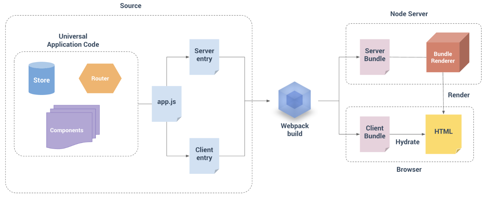

# 自定义模版之服务器端渲染

## 1. 相关技术
前端项目的技术栈：vue, vuex, vue-router, axios, iview
后端 vue-server-render, express, vue

Vue SSR构建流程


## 2. 源码介绍
### 2.1 前端项目结构
```sh
src
├── components
│   ├── DragResize.vue
│   ├── DragResizePreview.vue
│   ├── TableResize.vue
│   └── ...
├── router
│   ├── index.js // 前端路由
│   └── routerServer.js // 服务器端路由
├── views
│   ├── Unauthorized.vue
│   ├── Template.vue
│   ├── TemplatePreview.vue
│   └── Home.vue
├── App.vue
├── main.js # 仅运行于浏览器
├── main-server.js # 仅运行于服务器
└── entry-server.js # 仅运行于服务器
```

### 2.2 main.js 前端项目入口
```js
import Vue from 'vue'
import App from './App'
import { createRouter } from './router'
import iView from 'iview'
import { createStore } from './store'
import { verifyMerchant } from '@/api'
import { SEPARATOR, THSIGN, TDSIGN } from '@/utils/constant'
import 'iview/dist/styles/iview.css'
import './assets/css/home.css'
Vue.use(iView)

Vue.config.productionTip = false
const router = createRouter()
const store = createStore()
router.beforeEach((to, from, next) => {
    // 路由守卫
  if (to.path != '/unauthorized') {
    verifyMerchant(to.query).then(data => {
      if (data.data.code < 0) {
        iView.LoadingBar.finish()
        next({ path: '/unauthorized', query: { code: data.data.code } })
      } else {
        next()
      }
    })
  } else {
    next()
  }
})

Vue.directive('dragx', (el, binding, vnode) => {
    // ...注册全局指令
})
new Vue({
  el: '#app',
  store,
  router,
  components: { App },
  template: '<App/>'
})
```
### 2.3 router/index.js前端路由
```js
import Vue from 'vue'
import Router from 'vue-router'
import Home from '@/views/Home'
import Unauthorized from '@/views/Unauthorized'

Vue.use(Router)

export function createRouter (context) {
  return new Router({
    routes: [{
      path: '/',
      name: 'Home',
      component: Home
    }, {
      path: '/unauthorized',
      name: 'Unauthorized',
      component: Unauthorized
    }, {
      path: '/*',
      redirect: '/'
    }]
  })
}
```
### 2.4 main-server.js 创建后端vue实例
Node.js 服务器是一个长期运行的进程。当我们的代码进入该进程时，它将进行一次取值并留存在内存中。这意味着如果创建一个单例对象，它将在每个传入的请求之间共享。
**为每个请求创建一个新的根 Vue 实例。**这与每个用户在自己的浏览器中使用新应用程序的实例类似。避免交叉请求状态污染 (cross-request state pollution)。
```js
import Vue from 'vue'
import App from './App'
import { createRouter } from './router/routerServer.js'
import { createStore } from './store'

Vue.config.productionTip = false
// 避免状态单例，导出一个工厂函数，用于创建新的应用程序
export function createApp () {
  const router = createRouter()
  const store = createStore()

  const app = new Vue({
    store,
    router,
    components: { App },
    template: '<App/>'
  })
  return { app }
}
```

### 2.5 entry-server.js中实现服务器端路由逻辑 (server-side routing logic)
```js
import { createApp } from './main_server.js'

export default context => {
  // 因为有可能会是异步路由钩子函数或组件，所以我们将返回一个 Promise，
  // 以便服务器能够等待所有的内容在渲染前，就已经准备就绪。
  return new Promise((resolve, reject) => {
    const { app } = createApp()
    const router = app.$router
    let url = '/TemplatePreview'
    const { fullPath } = router.resolve(url).route

    if (fullPath != url) {
      return reject(new Error('找不到模板'))
    }
    if (!context.state) {
      return reject(new Error('未传入需要渲染的模板数据'))
    }
    // 设置服务器端 router 的位置
    router.push(url)
    router.onReady(() => {
      const matchedComponents = router.getMatchedComponents()
      // no matched routes
      if (!matchedComponents.length) {
        return reject(new Error('找不到模板'))
      }
      // 初始化模版数据
      app.$store.commit('SET_TEMPLATE_DATA', {
        ...context.state
      })
      app.$store.commit('SET_TEST_DATA', {
        ...context.state
      })
      // Promise 应该 resolve 应用程序实例，以便它可以渲染
      resolve(app)
    })
  })
}
```

### 2.6 routerServer.js服务器端路由
```js
import Vue from 'vue'
import Router from 'vue-router'
import TemplatePreview from '@/views/TemplatePreview.vue'

Vue.use(Router)

export function createRouter (context) {
  return new Router({
    routes: [{
      path: '/TemplatePreview',
      name: 'TemplatePreview',
      component: TemplatePreview
    }]
  })
}
```

## 3. 构建配置

### 3.1 服务端配置
webpack配置文件
```js
const merge = require('webpack-merge')

// 引入的是webpack的主要配置文件
const base = require('./webpack.base.conf')
module.exports = merge(base, {
  // 这允许 webpack 以 Node 适用方式处理动态导入，
  // 并且还会在编译 Vue 组件时，告知 `vue-loader` 输送面向服务器代码
  target: 'node',

  // 将 entry 指向应用程序的 server entry 文件
  entry: './src/entry_server.js',
  
  output: {
    filename: '../../server/lib/bundle.server.js',
    // 此处告知 server bundle 使用 Node 风格导出模块
    libraryTarget: 'commonjs2'
  }
})

```
通过命令`npm run build:server` 生成 bundle.server.js 文件用于服务器端
服务器端使用 bundle.server.js 文件渲染生成html字符串

```js
const renderer = require('vue-server-renderer').createRenderer()
const createApp = require('../lib/bundle.server.js')['default']
const app = await createApp(context)
// 将 Vue 实例渲染为字符串
const html = await renderer.renderToString(app)
let str = `
  <!DOCTYPE html>
  <html lang="en">
    <head>
      <meta charset="UTF-8">
      <title></title>
      <style>
        *{
          box-sizing: border-box;
        }
        html,body {
          margin: 0;
          padding: 0;
          width: 100%;
          height: 100%;
        }
      </style>
    </head>
    <body>
      ${html}
    </body>
  </html>`
```