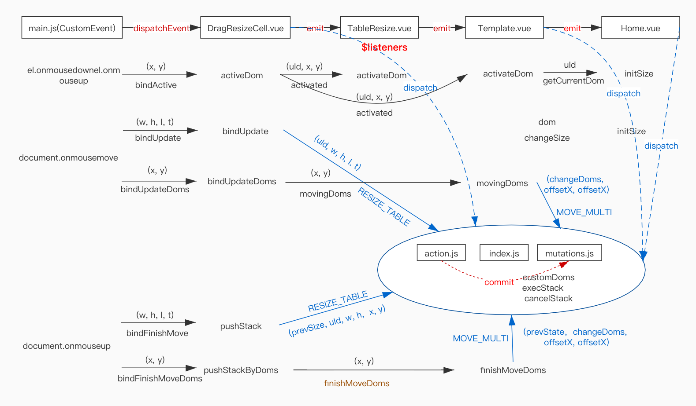

# 自定义模版之表格元素拖拽resize+move

## utils/constant.js
定义表格元素属性ID分隔符
```js
export const SEPARATOR = '**'
export const THSIGN = '**th**'
export const TDSIGN = '**td**'
```
## main.js
DOM元素resize或者move的时候，需要返回表格left 和 top值
```js
import { SEPARATOR, THSIGN, TDSIGN } from '@/utils/constant'
el.onmouseup = e => {
    // ...
    if (el.id.indexOf(THSIGN) > -1 || el.id.indexOf(TDSIGN) > -1) {
        let table = document.getElementById(el.id.split(SEPARATOR)[0])
        tableStyle = window.getComputedStyle(table)
        data.left = getStyleNumValue(tableStyle, 'left')
        data.top = getStyleNumValue(tableStyle, 'top')
    }
    // ...
}
document.onmousemove = edom => {
    if (el.id.indexOf(THSIGN) > -1 || el.id.indexOf(TDSIGN) > -1) {
        let newLeft = Math.round(getStyleNumValue(tableStyle, 'left') || '0', 10) + deltX
        let newTop = Math.round(getStyleNumValue(tableStyle, 'top') || '0', 10) + deltY
        data.left = Math.round(newLeft)
        data.top = Math.round(newTop)
    }
}
```
utils/index.js
`computeTableSize` 函数返回表格的宽高

```js
export const computeTableSize = table => {
  let w = 0
  let h = 0
  if (table.key == 'tableBorder') {
    let trW = 0
    let trH = 0
    table.tableData.forEach((tr, i) => {
      trH += Number(tr[0].domSize.h)
      if (i == 0) trW += tr.reduce((total, curr) => total + Number(curr.domSize.w), 0)
      tr.forEach(td => {
        td.multiAcive = false
      })
    })
    w = trW + (table.tableData[0].length + 1) * table.domSize.border
    h = trH + (table.tableData.length + 1) * table.domSize.border
  } else {
    table.columns.forEach(td => {
      td.multiAcive = false
    })
    table.tableData.forEach(td => {
      td.multiAcive = false
    })
    // 加上border的宽度
    w = table.columns.reduce((total, curr) => total + Number(curr.domSize.w), 0) + (table.columns.length + 1) * table.domSize.border
    if (table.tableData[0]) {
      h = Number(table.columns[0].domSize.h) + Number(table.tableData[0].domSize.h) + 3 * table.domSize.border
    } else {
      h = 0
    }
  }
  return { w, h }
}
```
## action.js
每次修改表格元素的大小和位置时，需要重新计算整个表格的大小和位置
```js
import { findIndexByDomId, computeTableSize } from '../utils'
import { SEPARATOR, THSIGN, TDSIGN } from '@/utils/constant'

  RESIZE_TABLE: ({ state, commit }, { id, left, top, width, height, prevSize }) => {
    let table = state.customDoms.find(dom => dom.id == id.split(SEPARATOR)[0])
    let dataId = id.split(SEPARATOR)[2]
    let oTD = table.tableData.find(item => item.id == dataId)
    let oTH = table.columns.find(item => item.id == dataId)
    let item = {
      oper: 'resizeTable',
      changeDoms: [oTD, oTH],
      resizeCells: [],
      table,
      prev: {
        ...prevSize
      },
      next: {
        x: left,
        y: top,
        w: width,
        h: height
      }
    }
    // 改变高时需改变同行元素的高
    if (id.indexOf(TDSIGN) > -1) {
      item.resizeCells = table.tableData
      table.tableData.forEach(td => {
        td.domSize.h = height
      })
    } else if (id.indexOf(THSIGN) > -1) {
      item.resizeCells = table.columns
      table.columns.forEach(th => {
        th.domSize.h = height
      })
    }
    // 改变宽时需同时改变同列元素的宽
    oTH.domSize.w = width
    oTD.domSize.w = width
    table.domSize.x = left
    table.domSize.y = top
    let { w, h } = computeTableSize(table)
    if (prevSize) {
      item.next.tableH = h
      item.next.tableW = w
      commit('PUSH_STACK', item)
    }
  },
```

## DragResizeCell.vue

```html
<template>
  <div v-dragx="{ dragBarClass: 'drag', dragContainerId: 'page', multiSelect, active }"
    :style="style"
    class="drag-wrap drag"
    @bindUpdate="bindUpdate"
    @bindActive="activeDom"
    @bindUpdateDoms="bindUpdateDoms"
    @bindFinishMove="pushStack"
    @bindFinishMoveDoms="pushStackByDoms">
    <slot></slot>
    <span class="iconfont icon-icon-resize"></span>
  </div>
</template>
<script>
import { SEPARATOR } from '@/utils/constant'
export default {
  data () {
    return {
      prevSize: {}
    }
  },
  props: {
    isVariable: {
      type: Boolean,
      default: false
    },
    active: {
      type: Boolean,
      default: false
    },
    size: {
      type: Object,
      default: () => ({
        x: 200,
        y: 200
      })
    },
    multiSelect: {
      type: Boolean,
      default: false
    },
    type: {
      type: String,
      default: 'table'
    },
    uId: {
      type: String,
      required: true
    },
    unit: {
      type: String,
      default: 'px'
    }
  },
  computed: {
    style: function () {
      let textAlign = ''
      let verticalAlign = ''
      switch (this.size.justifyContent) {
        case 'flex-start':
          textAlign = 'left'
          break
        case 'flex-end':
          textAlign = 'right'
          break
        case 'center':
          textAlign = 'center'
          break
        default :
          textAlign = 'left'
      }
      switch (this.size.alignItems) {
        case 'flex-start':
          verticalAlign = 'top'
          break
        case 'flex-end':
          verticalAlign = 'bottom'
          break
        case 'center':
          verticalAlign = 'center'
          break
        default :
          verticalAlign = 'center'
      }
      return {
        width: this.size.w + this.unit,
        height: this.size.h + this.unit,
        fontSize: this.size.fontSize + 'pt',
        opacity: this.size.opacity,
        textOverflow: this.size.textOverflow,
        textAlign,
        verticalAlign,
        lineHeight: this.size.lineHeight,
        transform: this.size.transform,
        fontWeight: this.size.fontWeight || 400,
        color: this.size.color || (this.isVariable ? '#666' : '#000'),
        backgroundColor: this.size.backgroundColor || '',
        fontStyle: this.size.fontStyle,
        textDecoration: this.size.textDecoration,
        overflow: this.size.overflow || '',
        wordBreak: 'break-all'
      }
    },
    hasMultiMoved () {
      return this.$store.state.hasMultiMoved
    }
  },
  methods: {
    activeDom (e) {
      this.$emit('activated', this.uId, e.detail.x, e.detail.y)
      let table = this.$store.state.customDoms.find(dom => dom.id == this.uId.split(SEPARATOR)[0])
      this.prevSize = {
        table: {
          ...table.domSize
        },
        w: this.size.w,
        h: this.size.h
      }
    },
    bindUpdate (event) {
      let data = event.detail
      this.type == 'table'
        ? this.$store.dispatch('RESIZE_TABLE', { id: this.uId, ...data })
        : this.$store.dispatch('RESIZE_TABLE_BORDER', { id: this.uId, ...data })
    },
    bindUpdateDoms (e) {
      this.$emit('movingDoms', e.detail)
    },
    pushStack (e) {
      let data = event.detail
      this.type == 'table'
        ? this.$store.dispatch('RESIZE_TABLE', { prevSize: this.prevSize, id: this.uId, ...data })
        : this.$store.dispatch('RESIZE_TABLE_BORDER', { prevSize: this.prevSize, id: this.uId, ...data })
    },
    pushStackByDoms (e) {
      this.$emit('finishMoveDoms', e)
    }
  }
}
</script>
<style scoped>
.drag-wrap {
 /*position: relative; 这个元素只能是正常定位，不能设为relative 或 absolute*/
  cursor: move;
}
.icon-icon-resize {
  position: absolute;
  right: 0;
  bottom: 0;
  line-height: 12px;
  cursor: se-resize;
  font-size: 12px;
  color: #666;
}
</style>
```

## TableResize.vue

```html
<template>
  <table
    cellpadding="0"
    cellspacing="10"
    :border="tableBorder"
    :id="uId"
    class="table-resize"
    :style="style">
    <caption v-if="caption" style="text-align: left;color: black;" :style="`font-size: ${captionFont}`">{{caption}}</caption>
    <thead v-show="showHeader !== 'N'">
      <tr :style="trStyle">
        <th v-for="(item, index) in columns"
          :key="`${uId}${separator}th${separator}${index}`"
          :class="{ active: active && uId+separator+'th'+separator+item.id == currentDataId, current: selectall || item.multiAcive }">
          <DragResizeCell
            v-on='$listeners'
            :size="item.domSize"
            :key="item.id"
            :active="uId+separator+'th'+separator+item.id == currentDataId"
            :uId="`${uId}${separator}th${separator}${item.id}`"
            :multiSelect="multiSelect"
            :unit="item.unit"
            :id="`${uId}${separator}th${separator}${item.id}`"
            :class="['edit-status', item.type == 'barcode' && 'barcode', item.type == 'qrcode' && 'qrcode', item.type == 'textBarcode' && 'text-barcode']"
            @activated="activateDom">
            
            {{item.text}}
          </DragResizeCell>
        </th>
      </tr>
    </thead>
    <tbody>
      <tr :style="trStyle">
        <td v-for="(item,index) in tableData"
        :key="`${uId}${separator}tbody${separator}${index}`"
        :class="{active: active &&  uId+separator+'td'+separator+item.id == currentDataId, current: selectall || item.multiAcive, barcode_td: item.type == 'img'}">
          <drag-resize-cell
            v-on='$listeners'
            :key="item.id"
            :size="item.domSize"
            :active="uId+separator+'td'+separator+item.id == currentDataId"
            :uId="`${uId}${separator}td${separator}${item.id}`"
            :multiSelect="multiSelect"
            :unit="item.unit"
            :isVariable="item.type == 'variable'"
            :id="`${uId}${separator}td${separator}${item.id}`"
            :class="['edit-status', item.type == 'barcode' && 'barcode', item.type == 'qrcode' && 'qrcode', item.type == 'textBarcode' && 'text-barcode']"
            @activated="activateDom">
            
            <template>{ {{item.text}} }</template>
          </drag-resize-cell>
        </td>
      </tr>
    </tbody>
  </table>
</template>
<script>
import DragResizeCell from '@/components/DragResizeCell'
import { SEPARATOR } from '@/utils/constant'

export default {
  components: { DragResizeCell },
  props: {
    uId: {
      type: String,
      default: ''
    },
    tableData: {
      type: Array
    },
    columns: {
      type: Array,
      default: () => []
    },
    border: {
      default: 1
    },
    active: {
      type: Boolean,
      default: false
    },
    multiSelect: {
      type: Boolean,
      default: false
    },
    showHeader: {
      type: String,
      default: 'Y'
    },
    posStyle: {
      type: Object,
      default: () => ({
        x: 30,
        y: 0
      })
    },
    caption: {
      type: String,
      default: ''
    }
  },
  computed: {
    style: function () {
      return {
        top: this.posStyle.y + 'px',
        left: this.posStyle.x + 'px'
      }
    },
    selectall: function () {
      return this.$store.state.selectall
    },
    captionFont: function () {
      return this.columns[0] ? this.columns[0].domSize.fontSize + 'pt' : '9pt'
    },
    tableBorder: function () {
      return this.border == 'horizontal' ? 0 : this.border
    },
    trStyle: function () {
      return {
        borderBottom: this.border == 'horizontal' ? '1px solid black' : ''
      }
    }
  },
  data () {
    return {
      currentDataId: '',
      separator: SEPARATOR
    }
  },
  methods: {
    activateDom (id, x, y) {
      this.currentDataId = id
    }
  }
}
</script>
<style scoped>
.barcode_td {
  background-image: url('../assets/barcode.gif');
  background-repeat: no-repeat;
}

.table-resize {
  position: absolute;
  border-collapse: collapse;
}

.table-resize tbody td {
  cursor: pointer;
}

th,
td {
  line-height: 24px;
  position: relative;
  cursor: pointer;
}

.resize-elem {
  position: absolute;
  height: 100%;
  width: 10px;
  left: 100%;
  margin-left: -5px;
  top: 0;
  cursor: col-resize;
}

.resize-text {
  text-overflow: ellipsis;
  overflow: hidden;
  white-space: nowrap;
}
</style>
```

## Template.vue
```html
<template>
  <div class="page" id="page" @mousedown="mousedown" @mouseup="mouseup" :style="`zoom: ${zoom}%`">
    <template v-for="item in customDoms" >
      <TableBorder v-if="item.type == 'table-border'"
        ref="table"
        :key="item.id"
        :tableData="item.tableData"
        :uId="item.id"
        :type="item.type"
        :posStyle="item.domSize"
        :multiSelect="multiSelect"
        :active="currentDataId.indexOf(item.id) > -1"
        @movingDoms="movingDoms"
        @finishMoveDoms="finishMoveDoms"
        @activated="activateDom">
      </TableBorder>
      <TableResize
        ref="table"
        v-else-if="item.type == 'table'"
        :key="item.id"
        :border="item.domSize.border"
        :tableData="item.tableData"
        :uId="item.id"
        :active="currentDataId.indexOf(item.id) > -1"
        :type="item.type"
        :columns="item.columns"
        :caption="item.caption"
        :posStyle="item.domSize"
        :multiSelect="multiSelect"
        :showHeader="item.showHeader"
        @movingDoms="movingDoms"
        @finishMoveDoms="finishMoveDoms"
        @activated="activateDom">
      </TableResize>
      <DragResize
        v-else
        dragContainerId = 'page'
        @activated="activateDom"
        @movingDoms="movingDoms"
        @finishMoveDoms="finishMoveDoms"
        @resizing="onResize"
        :uId="item.id"
        :key="item.id"
        :size="item.domSize"
        :active="item.id == currentDataId"
        :multiSelect="multiSelect"
        :isVariable="item.type=='variable'"
        :item="item"
        :class="[item.type != 'line' && 'edit-status', item.id == currentDataId && 'active', (item.multiAcive || selectall) && 'current', item.type == 'barcode-img' && 'barcode', item.type == 'qrcode-img' && 'qrcode', item.type == 'textBarcode-img' && 'text-barcode']">
      </DragResize>
    </template>
  </div>
</template>
<script>
import DragResize from '@/components/DragResize'
import TableResize from '@/components/TableResize'
import TableBorder from '@/components/TableBorder'
import { findDomByDomId, getPrevState, findDomByDomIdExceptCell } from '@/utils/'
import { SEPARATOR } from '@/utils/constant'

export default {
  name: 'Template',
  components: { DragResize, TableBorder, TableResize },
  data () {
    return {
      SEPARATOR,
      currentDataId: '',
      eX: 0,
      eY: 0,
      prevX: 0,
      prevY: 0,
      choosenDoms: [],
      choosenDomIds: [],
      barcodes: [],
      prevState: []
    }
  },
  computed: {
    customDoms () {
      return this.$store.state.customDoms || []
    },
    multiSelect () {
      return this.selectall || this.choosenDoms.length > 0
    },
    selectall () {
      return this.$store.state.selectall
    },
    zoom () {
      return this.$store.state.page.zoom || 100
    },
    zoomsize () {
      return this.$store.state.zoomsize
    }
  },
  watch: {
    selectall (newV) {
      this.choosenDoms.forEach(dom => {
        dom.multiAcive = false
      })
      if (newV) {
        this.choosenDoms = this.customDoms.filter(div => div.tag != 'table')
        let tables = this.customDoms.filter(div => div.tag == 'table')
        this.choosenDoms.push(...tables) // 表格也需要修改位置信息
        tables.forEach(table => {
          if (table.key !== 'tableBorder') {
            this.choosenDoms.push(...table.columns)
            this.choosenDoms.push(...table.tableData)
          } else {
            table.tableData.forEach(tr => this.choosenDoms.push(...tr))
          }
        })
      } else {
        this.choosenDoms = []
      }
    }
  },
  methods: {
    movingDoms (e) {
      if (this.choosenDomIds.indexOf(e.id) == -1 && !this.selectall) return
      let changeDoms = this.choosenDoms
      this.$store.dispatch('MOVE_MULTI', {
        changeDoms,
        offsetX: e.x - this.eX,
        offsetY: e.y - this.eY
      })
      this.eX = e.x
      this.eY = e.y
    },
    finishMoveDoms (e) {
      let changeDoms = this.choosenDoms
      let item = {
        prevState: getPrevState(this.prevState),
        changeDoms: changeDoms,
        offsetX: e.x - this.eX,
        offsetY: e.y - this.eY
      }
      this.$store.dispatch('MOVE_MULTI', item)
      this.eX = e.x
      this.eY = e.y
    },
    mousedown (e) {
      let currId = (e.target || e.srcElement).id
      if (this.choosenDomIds.indexOf(currId == -1)) {
        this.eX = e.x / this.zoomsize
        this.eY = e.y / this.zoomsize
      }
      this.prevX = e.pageX
      this.prevY = e.pageY
      this.prevState = JSON.parse(JSON.stringify(this.customDoms))
      let id = (e.target || e.srcElement).id
      if (id.indexOf(SEPARATOR) == -1 && this.$refs.table) {
        this.$refs.table.forEach(table => {
          table.activateDom({ id: '' })
        })
      }
      let obj = findDomByDomId(this.customDoms, id)
      if (!obj) {
        this.$emit('getCurrentDom', '')
        this.currentDataId = ''
      }
      if (e.ctrlKey && obj) {
        obj.multiAcive ? this.$set(obj, 'multiAcive', false) : this.$set(obj, 'multiAcive', true)
        let index = this.choosenDomIds.findIndex(item => item == id)
        let tableIndex = this.choosenDomIds.findIndex(item => item == obj.tableId)
        console.log(index, tableIndex)
        if (obj.multiAcive) {
          if (index == -1) {
            this.choosenDoms.push(obj)
            this.choosenDomIds.push(id)
          }

          // 多选时需要修改表格的位置
          let table = findDomByDomIdExceptCell(this.$store.state.customDoms, obj.tableId)
          if (table) {
            if (tableIndex == -1) {
              this.choosenDomIds.push(obj.tableId)
              this.choosenDoms.push(table)
            }
          }
        } else {
          if (index > -1) {
            this.choosenDoms.splice(index, 1)
            this.choosenDomIds.splice(index, 1)
          }
          // 需要重新获取一遍index
          tableIndex = this.choosenDomIds.findIndex(item => item == obj.tableId)
          if (tableIndex > -1) {
            this.choosenDoms.splice(tableIndex, 1)
            this.choosenDomIds.splice(tableIndex, 1)
          }
        }
      }
    },
    mouseup (e) {
      if (!e.ctrlKey && this.prevX == e.pageX && this.prevY == e.pageY) {
        this.eX = e.pageX / this.zoomsize
        this.eY = e.pageY / this.zoomsize
        let id = (e.target || e.srcElement).id
        if (id.indexOf(SEPARATOR) > -1) id = id.split(SEPARATOR)[2]
        let obj = findDomByDomId(this.choosenDoms, id)
        if (!obj) {
          this.choosenDoms.forEach(dom => {
            dom.multiAcive = false
          })
          this.prevState = []
          this.choosenDoms = []
          this.choosenDomIds = []
        }
      }
    },
    onCancelOper () {
      this.$store.commit('SET_SELECT_ALL', false) // 撤销后取消全选
      this.choosenDoms = []
      this.choosenDomIds = []
      this.currentDataId = ''
    },
    activateDom (id, x, y) {
      this.eX = x * this.zoomsize
      this.eY = y * this.zoomsize
      this.currentDataId = id
      this.$emit('getCurrentDom', this.currentDataId)
    },
    onResize: function (e) {
      if (!this.currentDataId) return
      let obj = this.customDoms.find(div => div.id == this.currentDataId)
      if (obj) {
        this.$emit('changeSize', obj)
      }
    }
  }
}
</script>
<style scoped>
  .edit-status{
    color: #666666;
    border: 1px solid #999999;
    cursor: move;
  }
  table {
    border-collapse: collapse;
    empty-cells: show;
  }
  .barcode {
    background-image: url('../assets/barcode.gif');
    background-repeat: no-repeat;
    background-size: 100% 100%;
  }
  .qrcode{
    background-image: url('../assets/qrcode.png');
    background-repeat: no-repeat;
    background-size: 100% 100%;
  }
  .text-barcode{
    background-image: url('../assets/withtext.gif');
    background-repeat: no-repeat;
    background-size: 100% 100%;
  }

</style>
```

## 事件流程图

